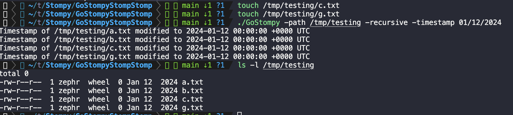

# GoStompy
GoStompy is the Go implementation of Stompy. Utilizing Go's standard libraries, it's designed to modify MAC (Modified, Accessed, Created) timestamps on systems, especially in environments where PowerShell or C# might not be viable options. It's also cross compatable meaning it'll compile for Windows/Mac/Linux no problem!

## Building
Before you can run GoStompy, you'll need to build the binary. Here's how you can do it:

1. Ensure you have Go installed. If not, download and install Go from the official website.

2. Navigate to the directory containing the GoStompy.go file.

```
go build GoStompy.go
```
This will generate an executable named GoStompy (or GoStompy.exe on Windows).

## Usage
Once built, you can run the GoStompy binary as follows:
```
./GoStompy -path path/to/file_or_directory -timestamp "DD/MM/YYYY" -recursive
```
Example:
```
./GoStompy -path ./documents -timestamp "01/01/2020" -recursive
```
This command will modify the timestamps of all files in the ./documents directory (recursively) to January 1, 2020.

## Example


## Limitations
- The script only modifies both the accessed and modified timestamps, not the created timestamp.
- Ensure you have appropriate permissions on the target files and directories.

